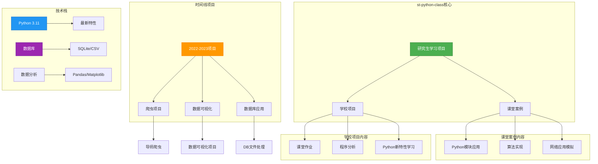

# 🐍st-python-class.github.io 🐍

这是一个用于记录我在研究生期间学校项目和课堂案例的 Github 项目，使用 Python 版本 3.11 和最新特性，同时也是为了代码存档和抄袭认定而创建的项目。

本项目中包含了：

- 学校项目：
  - 根据要求完成课堂作业
  - 分析和编写程序
  - 学习新的 Python 特性
- 课堂案例：
  - 使用现有的 Python 模块
  - 设计和实现算法
  - 模拟网络应用

所有的文件都将按照时间记录，以便追踪项目的进展和变化。

## 📊 项目架构图

本项目由 ASU 学生创建，欢迎提出宝贵意见，谢谢！
